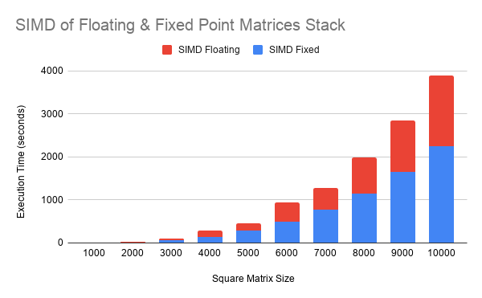

# SIMD matrix multiplication:
This project involves matrix multiplication using intel intrinsics for both floating and fixed (2 byte) point data.

## Code Structure
As I have decided to do this in C which doesn't support template syntax, there are two pairs of files that contain the implementation of fixed and floating point matrix multiplication.  The floating point implementation is contained within fp_matrix.c file while the fixed point is implemented in si_matrix.c (si stands for short int).  Their respective header files contain common functions to generate, free, randomize, perform a checksum, print, and multiply matrices (both with and without SIMD & optimizations).  The naive multiplication functions are standard and don't require a detailed description. 

### SIMD Functions
At the top of both fp_matrix.c and si_matrix.c you will see `#include <immintrin.h>` which will allow use of Intel Intrinsics.  The following is a description of the wrappers used to perform the multiplication.

#### _Fixed Point_
All fixed point instructions used here require SSE2.

`_mm_loadu_si128(__m128i const* mem_addr)` - Load 128-bits of integer data from memory into dst. mem_addr does not need to be aligned on any particular boundary.

`_mm_set1_epi16(short a)` - Broadcast 16-bit integer a to all all elements of dst. This intrinsic may generate vpbroadcastw.

`_mm_add_epi16(__m128i a, __m128i b)` - Add packed 16-bit integers in a and b, and store the results in dst.

`_mm_store_si128(__m128i* mem_addr, __m128i a)` - Store 128-bits of integer data from a into memory. mem_addr must be aligned on a 16-byte boundary or a general-protection exception may be generated.

#### _Floating Point_
All floating point instructions used here require AVX.

`_mm256_load_ps(float const * mem_addr)` - Load 256-bits (composed of 8 packed single-precision (32-bit) floating-point elements) from memory into dst. mem_addr must be aligned on a 32-byte boundary or a general-protection exception may be generated.

`_mm256_broadcast_ss(float const * mem_addr)` - Broadcast a single-precision (32-bit) floating-point element from memory to all elements of dst.

`_mm256_mul_ps(__m256 a, __m256 b)` - Multiply packed single-precision (32-bit) floating-point elements in a and b, and store the results in dst.

`_mm256_store_ps(float * mem_addr, __m256 a)` - Store 256-bits (composed of 8 packed single-precision (32-bit) floating-point elements) from a into memory. mem_addr must be aligned on a 32-byte boundary or a general-protection exception may be generated.

#### _Common_
Many of the Intel intrinsic instructions require boundary alignment in order to work properly, in cases where it isn't aligned (and alignment is required) it could cause a seg fault.  At the top of both files there is a macro definition for `BOUNDARY_ALIGNMENT` that will ensure that the matrix's cells will be properly aligned with the use of `_mm_malloc(int size, int align)` (OS independent) and `_mm_free (void *p)`.

### Cache Optimization
Cache optimizations are only implemented for SIMD multiplication.  One of the main goals here is to load a value into the cache and use it multiple times to avoid having many cache misses.  Below is a snippet of code from fp_matrix.c with modified comments.  The algorithm is the same for fixed and floating point.  A technique called loop nest optimization ([LNO](https://en.wikipedia.org/wiki/Loop_nest_optimization)) is used to maximize cache efficiency this is also called register blocking.  For a more detailed look at optimizations for matrix multiplication visit [Nadav Rotem's Gist](https://gist.github.com/nadavrot/5b35d44e8ba3dd718e595e40184d03f0).

```c
/* must go through entire matrix to calculate a piece of c (the result matrix) */
for(row_count = 0; row_count < size; row_count++) { // loop 1
  for(b_bi = 0; b_bi < b_block_size; b_bi++) { // loop 2
    /* load 8 short ints (simd) from matrix b on this particular row and block offset.
     * NOTE: this is going down matrix b */
    b_r = _mm_loadu_si128((__m128i*) (b[row_count] + 8*(b_bi + b_block_index * AVX_REG_B_MAX)));
    for(a_bi = 0; a_bi < a_block_size; a_bi++) { // loop 3
      /* load simd reg by broadcasting a value from a. NOTE: this is going across
       * matrix a. */
      a_r = _mm_set1_epi16(a[a_bi + a_block_index*AVX_REG_A_MAX][row_count]);
      
      /* add to local cache at block offsets */
      c_local[a_bi][b_bi] = _mm_add_epi16(c_local[a_bi][b_bi], _mm_mullo_epi16(a_r, b_r));
    }
  }
}
```

In this series of loops you will first notice that a SIMD width float (8 floats) from `b` is loaded into `b_r` and therefore also loaded into the cache.  In loop 3 a value from `a` is brodcast into `a_r`.  Then, `a_r` and `b_r` are multiplied together and are added to `c_local` which is on the stack (to allow for faster read/writes).  The critical part here is that a single row in `b` is being re-used for the entirety of loop 3, and for the next iteration of loop 1, loop 3 will won't require any additions to the cache (on most iterations) because `a[a_bi + a_block_index*AVX_REG_A_MAX]` will already be in the cache from the previous iteration (note that `[row_count]` offset will be in the same cache line every 8 iterations of loop 1).  For a full context of the above code snippet view fp_matrix.c.

Changes to `a_block_size` and `b_block_size` tweak the ratio of memory to arithmetic instructions.  The maximum for both of these numbers are defined at the top of the source files as `AVX_REG_A_MAX` and `AVX_REG_B_MAX` respectively.  The more arithmetic instructions per memory instruction the better.

## Build & Requirements
In order to run this code your CPU must support the following flags: SSE2 (for fixed point), and AVX (for fixed point).

A simple way to check is to use regular expressions to search for the flags for example:

`$ grep -E '(avx.*sse2)|(sse2.*avx)' /proc/cpuinfo -c`

Your CPU supports both AVX and SSE2 if the above line returns the number of physical cores you have (0 if unsupported).

To build the code run the top line in the comp file:
```
$ cat comp
gcc main.c fp_matrix.c si_matrix.c -o prog -mavx -Wall
gcc -S -masm=intel -mavx main.c
$ gcc main.c fp_matrix.c si_matrix.c -o prog -mavx -Wall
```
Note that the second line in comp can be used to produce an assembly dump (in Intel syntax of a given file).  This can be used to make micro-optimizations by seeing what the compiler is outputting and tweaking your source to produce better assembly.

**NOTE:** My code uses the sys/time.h included on POSIX compliant operating systems which is not included int the Windows C libraries.  This only applies to compilers native to Windows such as mingw, most systems that provide a Unix-like command line (or full emulation) will have this file such as WSL, Git Bash, and Cygwin.  If this isn't available on your system, the timing code can be removed/altered to allow the program to build.

## Running
To run the program it needs two arguments, the size of the square matrices and flags:  `$ ./prog size flags`

Description of flags:
* n - Run naive implementation
* s - Run SIMD implementation
* i - Run with integer (2 byte) matrices
* f - Run floating point (4 byte) matrices
* p - Print out matrices (this should only be used for small matrices)

Example to run SIMD & naive implementation for floating and fixed point matrices with size of 128.
```
$ ./prog 128 snif
NAIVE Checksum Fixed Point: -28805 in 0 seconds
SIMD  Checksum Fixed Point: -28805 in 0 seconds
NAIVE Checksum: 524038.656250 in 0 seconds
SIMD  Checksum: 524038.656250 in 0 seconds
```
The checksums can be used to verify that both the naive and SIMD implementations return the same result.

**NOTE:** Flags have no delimiters so they should be entered all in one string (order doesn't matter).  Also if neither n -or- s is specified then both with be run, the same goes for the i and f flags.

## Results
All tests were run on Intel Xeon v2 processors which are older Ivy Bridge server processors.  I would suspect that there would be vast improvments in running time on newer architectures especially when the appropriate optimizations are used.  Furthermore single server CPU cores are typically much slower than their desktop (and sometimes even laptop) counterparts, however they typically have much larger caches.  I would have to do some testing but on newer desktop cores performance I would imagine a potential increase by 5-10x for SIMD.

Here are the results for the running time of both the SIMD and naive implementations for both fixed and floating point matrices measured in seconds.  There are two graphs displaying the same data for more context.


It takes too long to run the naive implementations for larger matrix sizes so the following are two graphs (again with the same data) for just the SIMD implementations.




## Analysis and Conclusion
As can be seen in the results, through the use of SIMD instructions and cache optimization running time can be vastly improved.  One interesting anomaly is that the SIMD floating point multiplication is faster than the fixed point multiplication in my program.

There are two primary reasons for this:
1. As my CPUs don't have AVX2, SIMD fixed point instructions are limited to 128 bits (SSE2) as opposed to the 256 bits that AVX offers for floating point instructions
2. I didn't make specific tweaks to optimize the interger algorithm (instead I just ported the floating point algorithm)

To summarize my results, if leveraged properly SIMD and cache optimizations can have a huge performance boost in data and arithmetic heavy programs such as matrix multiplication.
